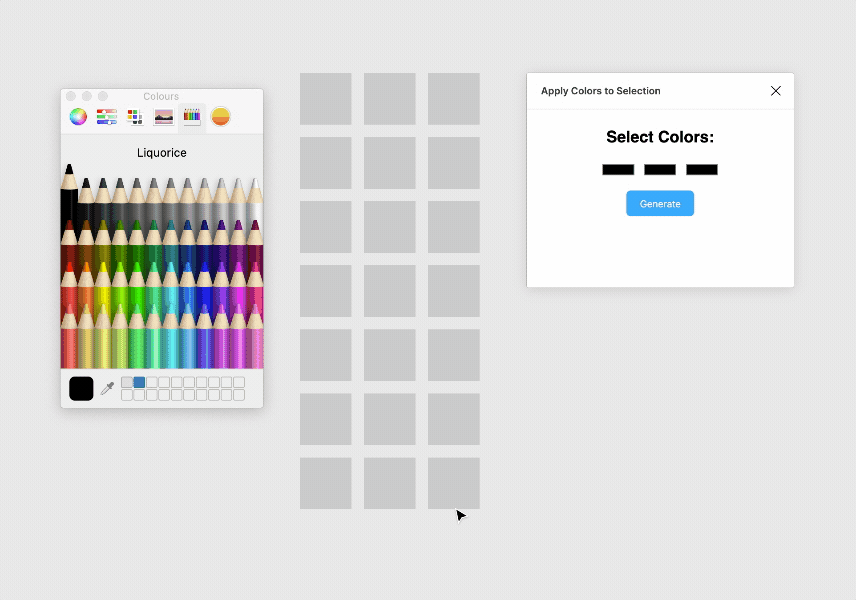

# Color Randomizer
Apply a set of colors randomly to a selection.

1. (Optional) Before opening the plugin, select the element(s) who's fill colour you want to use as a swatch.

1. Open the plugin which will now show the swatches based on your selection.

1. Add any more colors you want to use.

1. Back on the canvas, select all the shapes you want to apply the colors to and hit "Apply Colors".

1. The plugin doesn't automatically close so you can hit "Apply Colors" as many times as you like.

**HINT:** If you want more of one color than others, add more swatches of that color.



## Build instructions
First clone the repository and install the dev dependencies:

```
git clone git@github.com:craigmdennis/figma-apply-colors-to-selection.git
cd figma-apply-colors-to-selection
npm install
```

Then compile the source files:

```
npm run watch
```

The main plugin code is in `src/code.ts`. The HTML for the UI is in
`src/ui.html`, while the embedded JavaScript is in `src/ui.ts`.

These are compiled to files in `dist/`, which are what Figma will use to run
your plugin.
